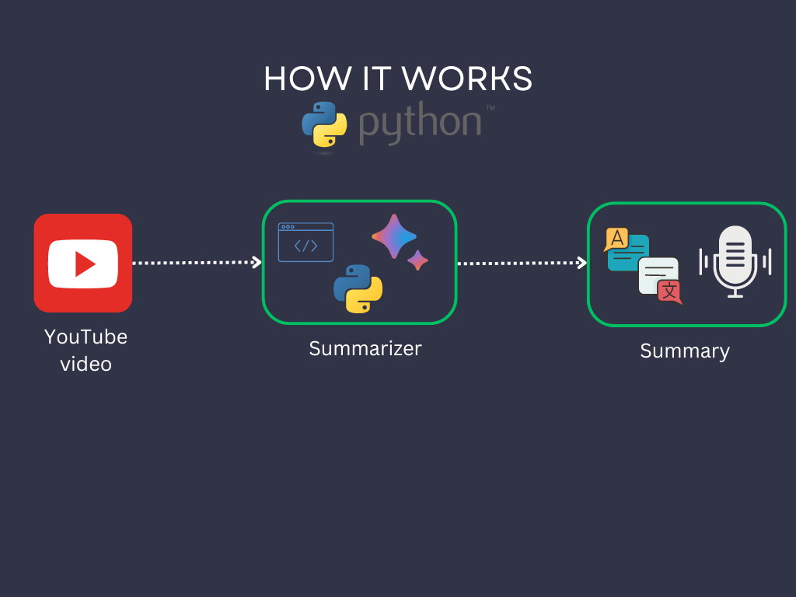

# YouTube Video Summarizer

This Streamlit application summarizes YouTube videos by extracting their transcripts and using Google's Generative AI to create a concise summary. The application is designed with a simple user interface allowing users to input a YouTube URL and their Google API key to get a summary of the video's content.

## How It Works
 


## Setup

### Prerequisites

- Python 3.7 or higher
- Streamlit
- `google-generativeai` library
- `python-dotenv` library
- `youtube_transcript_api` library

### Installation

1. **Clone the Repository** (if applicable)
   
   ```bash
   git clone https://github.com/HimanshuSinghRaghav/Youtube_video_Summeriser.git
   cd Youtube_video_Summeriser
   python -m venv venv
   source venv/bin/activate  # On Windows: venv\Scripts\activate
   pip install streamlit google-generativeai python-dotenv youtube_transcript_api
   streamlit run app.py


